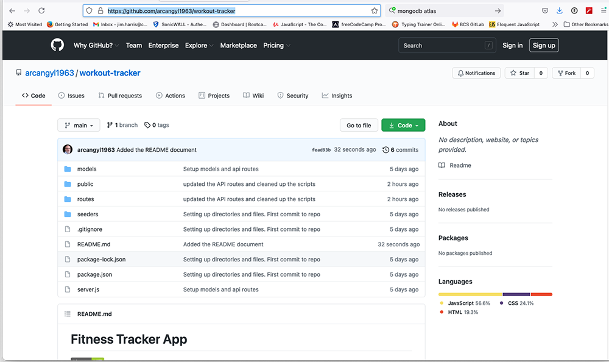

# Fitness Tracker App

 

## Description: 

The Fitness Tracker is a web application that allows a user to input their personal workout information for both resistance training and cardio workouts. The app allows the user to enter multiple excersises for one workout session. It tracks the time duration of the workout, the weight totals lifted for resistance training, and the distance traveled for the cardio workouts where applicable. All of this statistical information can be viewed in a graphical chart format on the user dashboard. 

The Fitness Tracker utilizes the following technologies:
  * JavaScript
  * NODE.JS
  * MongoDB
  * NPM packages:
    * ExpressJS
    * Mongoose
    * Morgan

---

## Table of Contents 

[Installation](#installation) 

[Usage](#usage) 

[Heroku](#heroku) 

[License](#license) 

[Contributors](#contributors) 

[Tests](#tests) 

[Questions](#Questions) 

---

## Installation: 

My files can be accessed in the repository [HERE](https://github.com/arcangyl1963/workout-tracker) 

The image below shows the repository where my project files are located:

 

Begin setting up your local repository by cloning the repo from the link above or by downloading the files to your local drive. 

The repository will contain all of the files needed to run the application and follows the MVC paradigm for directory structure: 

* A 'models' directory containing the model classes for the Users, Posts, and Comments.
* A 'public' directory that houses the javascripts and the CSS stylesheet.
* A 'routes' directory containing the route scripts for API calls and for the views.
* A 'seeders' directory that contains a script to populate the database with placeholder data.
* An 'images' directory containing the image files for the README document.
* A package.json file that contains the package dependencies required for the application to run and the application script information.
* A server.js script file that is invoked in NodeJS to run the server backend which serves the front-end application site.

Next proceed by creating the database using the MongoDB CLI (or you may use a GUI software application such as Robo 3T). If you have not installed MongoDB, you can find installation instructions for your operating system [here](https://docs.mongodb.com/manual/installation/):

  In Terminal or a similar BASH utility, make sure that the MongoDB service is running. enter:
  ~~~
  mongo
  ~~~
  If the mondod service is running, the Mongo CLI will start. If Mongo CLI does not start, enter the following in your command-line app:
  ~~~
  mongod
  ~~~
  Create the database from the Mongo CLI:
  ~~~
  mongo --to start Mongo CLI
  use workout --will create the database if it does not already exist
  ~~~
  To populate the database with placeholder data, run the following from your CLI:
  ~~~
  npm run seed
  ~~~
 

Once the database has been created, you will install any package dependencies required to run the server application and to setup the development environment on your local repository. 

In Terminal or a similar bash command-line utility, navigate to the working directory and enter: 

~~~
npm install OR npm i
~~~

This will install any package dependencies defined in the package.json file. 

---

## Usage: 
To run the application locally type the following into Terminal or the command-line utility of your choice: 

~~~
npm start
~~~

The server application will launch and you will see 'App listening on port 8080!'.
Enter https://localhost:8080/ into the address field of your web browser. 

You will be presented with the Fitness Tracker main screen. If you pre-populated the database, the main screen will display the last workout entered. You have the option to Continue entering info for that workout session or create a new workout. If there are no workouts entered, only the New Workout option is available. 

 

The New Workout entry panel displays different entry field options depending on the type of workout selected - resistance or cardio. 

Resistance entry panel: 
 

Cardio entry panel: 
 

Click the Dashboard link in the navbar to view the workout charts for cardio and resistance exercises. 

 

## Heroku:

The Third Triad Mojo Tech Blog site can be accessed from this Heroku Deployment link:
[Heroku deployed app](https://shielded-eyrie-42315.herokuapp.com//)

---

## License: 

 This software is licensed under an MIT license:  Copyright © 2021 Arcangyl Studios  Permission is hereby granted, free of charge, to any person obtaining a copy of this software and associated documentation files (the 'Software'), to deal in the Software without restriction, including without limitation the rights to use, copy, modify, merge, publish, distribute, sublicense, and/or sell copies of the Software, and to permit persons to whom the Software is furnished to do so, subject to the following conditions: The above copyright notice and this permission notice shall be included in all copies or substantial portions of the Software. THE SOFTWARE IS PROVIDED 'AS IS', WITHOUT WARRANTY OF ANY KIND, EXPRESS OR IMPLIED, INCLUDING BUT NOT LIMITED TO THE WARRANTIES OF MERCHANTABILITY, FITNESS FOR A PARTICULAR PURPOSE AND NONINFRINGEMENT. IN NO EVENT SHALL THE AUTHORS OR COPYRIGHT HOLDERS BE LIABLE FOR ANY CLAIM, DAMAGES OR OTHER LIABILITY, WHETHER IN AN ACTION OF CONTRACT, TORT OR OTHERWISE, ARISING FROM, OUT OF OR IN CONNECTION WITH THE SOFTWARE OR THE USE OR OTHER DEALINGS IN THE SOFTWARE. 

---

## Contributors: 

James Harris 

---

## Tests: 

There were no test scripts created for this application. 

---

## Questions: 

- Feel free to email me with any questions about this project at: arcangyl@gmail.com 

 

- My GitHub profile may be viewed by clicking [here](https://github.com/arcangyl1963).